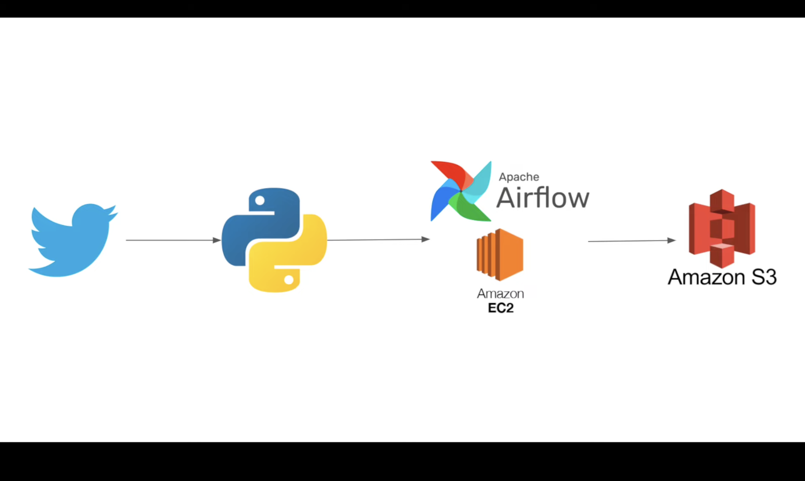
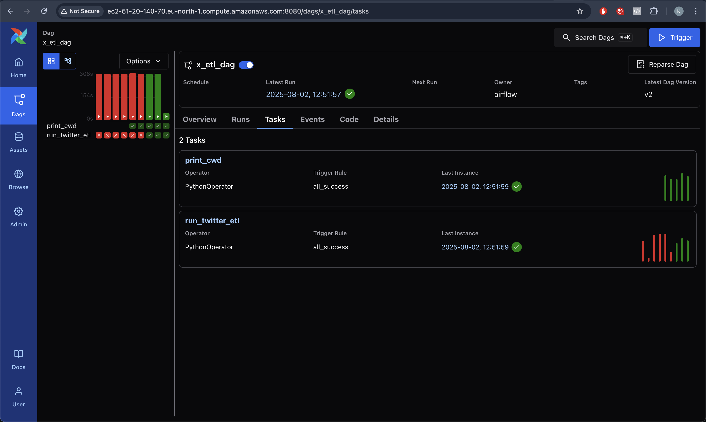
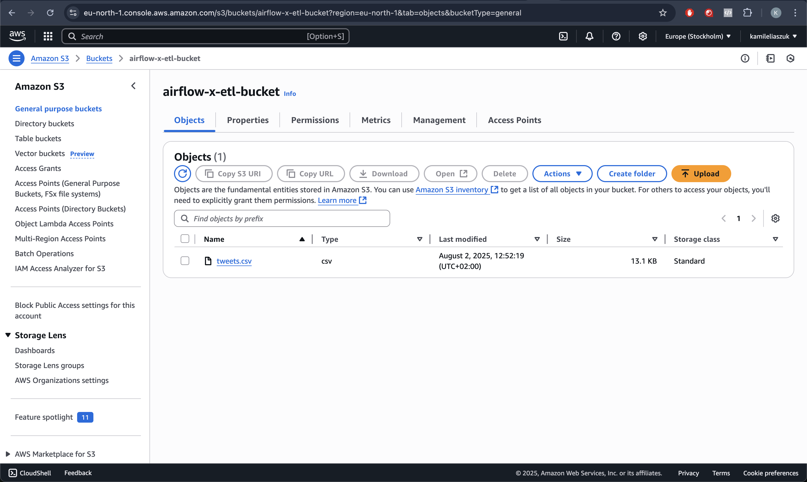

# X/Twitter ETL Pipeline
This repository contains a simple ETL pipeline for extracting, transforming, and loading data from X/Twitter using Apache Airflow running on EC2 machine. The pipeline is designed to fetch tweets, and store them in a CSV file in an S3 bucket.

